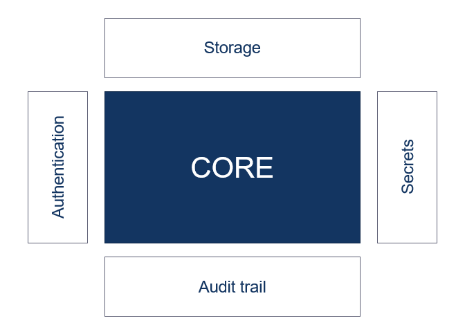

Almost every application uses secrets to access secured parts of the software landscape. I think that almost everyone can relate to me when I say that keeping secrets in config files with the rest of your code base is a very "easy" solution for keeping your secrets. A sentence that I have heared a lot when it comes to keeping secrets in your code base is:

> 'Why not, the only persons that can access our code base is our team self.'

This was something that I told myself too, but keeping your secrets in configuration files doens't only mean that they are stored in the repository. Deploying software means putting your code in a place where it can run including all the configuration files that are necesarry to run your software. So when you deploy software to a test, acceptance and production environment means three more places of where your secrets are stored.

Software that is deployed is vulnerable for hacking attempts and you can try as hard as you can, but hackers will eventually be able to access your environment and have access to all of your secrets. In this way, they immediatly have access to your database or other secured parts of your landscape.

There are many best practices that can prevent hackers to get access to your environment, but what if they get through en get access to your environment? Do you feel safe engough to keep your secrets lying around? In this blog I will tell you about the basics of secret management with [Hashicorp Vault](https://www.vaultproject.io/).

## Secret management

In my opinion, a secret is everything that grants authentication or authorization for a user or application. So a secret can be somehting like a username/password, database credentials, API tokens or even TLS certificates.

If you ask me, managing secrets is hard. Managing secrets includes a few things. One of them is keeping track of whom has access to which secret (Access control management). The second thing is that you should know whom is using which secret (Audit trail). So in case of a security breach you can see who is responsible for the breach. The third part of secret management is to able to rotate a secret.

These management tasks come with 'a few' challenges. For example, one of the most obvious challenges is __secret sprawl__. This means that all your secrets are spread through your application. A few places of which you can find your secrets is in your source code (hard coded), in configuration files and ultimately in your VCS (Version Control system like git). How do you keep track of where all your secrets are?

The second challenge is a consequence of secret sprawl, namely __access control__. Try to keep track of whom has access to which secret if they are all spread accross your code base. For example, if you have a development team that can access your code base, the whole team has access to your secrets. Or if you have an ops guy that is in charge over your environments, he can access the secrets that are in the configuration files. In other words, there are most likely more people who have access to your secrets then you know. Beside knowing who has access to your secrets, it can also be very usefull to know whom has used a secret. So you can find out what secret has been compromised and by whom. 

The third challenge has to do with __secret rotation__. It's very common to change a secret once in a while. There can be different reasons why you should do that, for example if a secret gets compromised, or if a secret gets out dated. It's very hard to rotate a secret that is hardcoded in the system or a secret that is spread across multiple applications.

## Hashicorp vault 

Vault is, as the name says, a vault that can be used to store secrets. Vault serves as a centralized place where you can store your secrets. All secrets are stored on a virtual file sytem. So every secret has its a path on which it can be accessed. Beside a centralized place to keep your secrets, using vault has a few more benefits. To keep your secrets save, all secrets stored in vault are encrypted. At rest as well as in transit are secrets encrypted, so if someone gets access to the secrets they can't read it.

Beside keeping your secrets safe, vault also provide an acces control layer (ACL). This means that you are able to create policies to which you can restrict the access for your secrets to whom needs access. Vault operates on a __secure by default__ standard, and as such, an empty policy grants __no permissions__ in the system. Therefore policies must be created to govern the behavior of clients and instrument Role-based Access Control (RBAC) by specifiying access privileges (authorization).

All secrets that are used are accessed via vault, this means that vault can keep a detailed log of all requests and responses. Because every operation with Vault is an API request/response, the audit log contains every authenticated interaction with Vault, including errors. It's possible to enable multiple audit devices, vault will send the the audit logs to all the devices enabled. Each line in the audit log is a JSON object. There are currently two types of logs, request and response. The line contains all of the information for any given request and response. By default, all the sensitive information is first hashed before logging in the audit logs.

### Dynamic secrets
In general, application do a terrible job at keeping secrets. Inevitably the application will log its credentials to standard out, which get shipped to something like Splunk, and anyone can see the secret. Perhaps the application will have an exception and shows the secret in a traceback or error report. In short, applications can't be trusted with keeping there secrets secret.

That is where Vault second level capability comes in, __dynamic secrets__. Dynamic secrets are ephemeral secrets, which means that they are only valid for a certain amount of time. Lets say, an application uses a dynamic database password which is valid for ten days. The application has an exception which result in a log to standard out that contains the database password. After ten days, a hacker gets access to the logs of the application and sees the database password. As he tries to use it, to get access to the database, his authorization fails because the password is not valid anymore. Therefore the level of security of the database is much higher than using a static password. 

Each application that uses a dynamic secrets gets its own unique secret. There are a few benefits the come hand in hand with using unique secret per application. The first one is that if a secret get compromised, you can immediatly trace it back to the application that has caused the leak. This allows the development team to investigate and solve security breaches faster, because they know what secret was compromised and to which service this secret was served.

The second benefit what comes with using unique secrets is that it's much easier to do secret revocation. So lets say your database password gets compromised and you need to change it immediatly. If you're using a static database password, then you have to change your password in every application that is connection to the database using that exact password but how sure are you that you changed all passwords before revoking the compromised secret? The blast radius of a static password is much bigger because you have to be sure that all applications are using the new password. Vaults unique secrets solves this problem! Each application has its own secret that can be revoked individually. 

I created a [demo project](https://github.com/tom171296/SecretManagement-Vault) where vault controles the secrets that are used by an application that connects to RabbitMQ. Just follow the readme and everything should be clear!

- Encryption
    
    Save encryption keys

    Encrypt as a service

## Vault’s architecture

Vault has a highly plugable architecture. This means that it can ......

