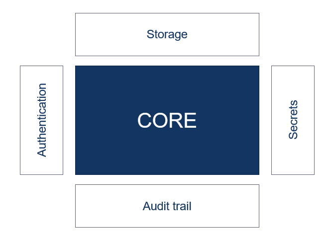

Almost every application uses secrets to access secured parts of the software landscape. A secret can be something like a client secret, database credentials or other sensitive data. I think that almost everyone can relate to me when I say that keeping secrets in config files with the rest of your code base is a very "easy" solution for keeping your secrets. A sentence that I have heared a lot when it comes to keeping secrets in your code base is:

> 'Why not, the only persons that can access our code base is our team self.'

This was something that I told myself too, but keeping your secrets in configuration files doens't only mean that they are stored in the repository. Deploying software means putting your code in a place where it can run including all the configuration files that are necesarry to run your software. So when you deploy software to a test, acceptance and production environment means three more places of where your secrets are stored.

Software that is deployed is vulnerable for hacking attempts and you can try as hard as you can, but hackers will eventually be able to access your environment and have access to all of your secrets. In this way, they immediatly have access to your database or other secured parts of your landscape.

There are many best practices that can prevent hackers to get access to your environment, but what if they get through en get access to your environment? Do you feel safe engough to keep your secrets lying around? In this blog I will tell you the basics of secret management with [Hashicorp Vault](https://www.vaultproject.io/).

## Secret management

In my opinion, a secret is everything that grants authentication or authorization for a user or application. So a secret can be somehting like a username/password, database credentials, API tokens or even TLS certificates.

If you ask me, managing secrets is hard. Managing secrets includes a few things. One of them is keeping track of whom has access to which secret (Access control management). The second thing is that you should know whom is using which secret (Audit trail). So in case of a security breach you can see who is responsible for the breach. The third part of secret management is to able to rotate a secret.

These management tasks come with 'a few' challenges. For example, one of the most obvious challenges is __secret sprawl__. This means that all your secrets are spread through your application. A few places of which you can find your secrets is in your source code (hard coded), in configuration files and ultimately in your VCS (Version Control system like git).

The second challenge is a consequence of secret sprawl, namely __access control__. Try to keep track of whom has access to which secret if they are all spread accross your code base. For example, if you have a development team that can access your code base, the whole team has access to your secrets. Or if you have an ops guy that is in charge over your environments, he can access the secrets that are in the configuration files. In other words, there are most likely more people who have access to your secrets then you know. Beside knowing who has access to your secrets, it can also be very usefull to know whom has used a secret. So you can find out what secret has been compromised and by whom. 

The third challenge has to do with __secret rotation__. It's very common to change a secret once in a while. There can be different reasons why you should do that, for example if a secret gets compromised, or if a secret gets out dated. It's very hard to rotate a secret that is hardcoded in the system or a secret that is spread across multiple applications.

## Hashicorp vault 

The biggest solution for all the above called challenges is to centralize all of your secrets right. That is exactly what vault offers. A centralized place to keep your secrets secure.

- centralize secrets
    Encrypt 
        At rest
        In transit

    ACL

    Audit trail

- dynamic secrets
    Ephemeral secrets

    Unique for each client

    Revocation

- Encryption
    Save encryption keys

    Encrypt as a service

## Vault’s architecture

## Demo

At first we have to deploy Vault. For development purposes Vault has a 'dev' server mode which doesn't require additional settings.This blog won't go into all the settings that are required for setting up Vault, this blog will fully focus on the use of Vault in .Net Core.

To make it easy for you I created a [demo project](https://github.com/tom171296/SecretManagement-Vault) where I placed a docker file that you can use to start a Vault instance in dev mode. You can verify that Vault is running by going to [localhost:8200](http://localhost:8200), here you should see the Vault UI like the picture below.
