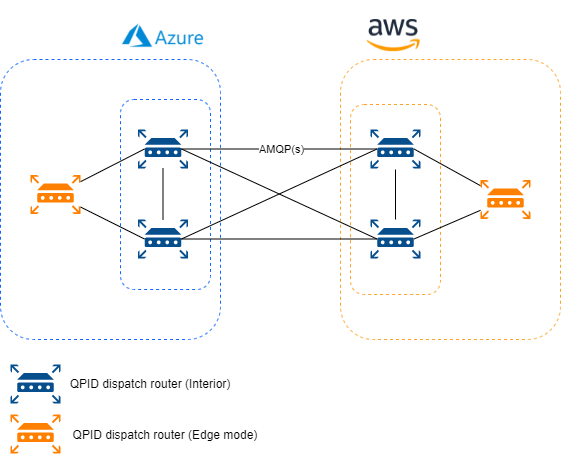
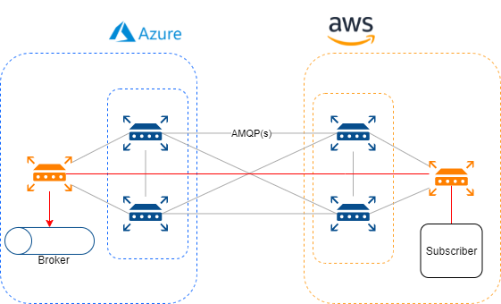

Enterprises are typically comprised of hundres, if not thousands, of applications that are custom built or acquired from a third party. In order to support common business processes and data sharing across applications, these applications need to be integrated. But how do you do that when there is more than one cloud in which your applications are running. In this blog I will tell you about how you can build an **mesh based** integration platform that is based on the open standard **AMQP 1.0** and is able to connect different (cloud) environments together. 

# The vision
So when I look at a typical enterprise integration platform, I think of a centralized service bus or something like that. At least there is something in a central place that handles all the integration for me. Usually this platform is managed by a team that has to serve the integration needs for an entire company. This causes the team to be fully overloaded with requests for new integrations.

What if we can build a decentralized platform. There should no longer be a team that is responsible for all the integrations within an enterprise. Integration should no longer be a single team responsibility. Each application team should be responsible for their own integration. This means a shift in the responsibilities. Where a centralized integration platform ususally focusses on OSI-layer 4 (transport) a decentralized platform is moving that responsibilities up to layer 7 (application). This means that each application itself is responsible for their integrations.

Thus a decentralized platform with which the team can manage integrations with other applications itself. The platform should decouple applications as well. The sending application doensn't necesarrily needs to know what application ends up receiving the message, but it can be assured that the information is received by everyone who is interested. When an application sends information, it doesn't randomly add the information to any channel available. It adds the information to a channel whose specific purpose is to communicate that sort of information. Channels are logical addresses in the messaging system.

Keeping in mind that in 2021 the amount of data that is being processed by applications is increasing more and more. Data gets a more important place in the IT world. The platform should be scalable to be able to process constantly getting bigger amounts of data. Sending more data over the platform should not result in a slower data flow. The platform should be smart enough to route high volumes of data in a way that it takes the shortest, less utilized route.

In short, the way I see this platform is that it has 
- Decentralized;
- Decouple applications (and their environment);
- Scalable.

# AMQP
AMQP 1.0 is an open standard approved by ISO and IEC. It is an efficient, reliable wire-level messaging protocol that you can use to build robust, cross-platform, messaging applications. The protocol has a simple goal: to define the mechanics of the secure, reliable, and efficient transfer of messages between two parties. 

Using an open standard as protocol has the following benefits:

- Less chance of vendor lock-in
- Interoperability
- Broad availability of libraries and tooling
- Protection against obsolescence
- Availability of knowledgeable staff
- Lower and manageable risk

AMQP 1.0 itself is an open standard with all the benefits of that. On top of all those benefits, there are a lot of features that it contains. These are the most important ones: 

- Efficient: AMQP 1.0 is a connection-oriented protocol that uses a binary encoding for the protocol instructions and the business messages transferred over it. It incorporates sophisticated flow-control schemes to maximize the utilization of the network and the connected components. That said, the protocol was designed to strike a balance between efficiency, flexibility, and interoperability.
- Reliable: The AMQP 1.0 protocol allows messages to be exchanged with a range of reliability guarantees, from fire-and-forget to reliable, exactly once acknowledged delivery.
- Flexible: AMQP 1.0 is a flexible protocol that can be used to support different topologies. The same protocol can be used for client-to-client, client-to-broker, and broker-to-broker communications.
- Broker-model independent: The AMQP 1.0 specification doesn't make any requirements on the messaging model used by a broker. This means that it's possible to easily add AMQP 1.0 support to existing messaging brokers.

The protocol works with credit base consumption. This means that a consumers gives AMQP credits to the network if it wants to consume messages. A producer is blocked when he wants to publish a message to a certain address when there are no credits.

# QPID dispatch router
The technology that we are gonna build the platform with is [Apache QPID dispatch router](https://qpid.apache.org/components/dispatch-router/index.html). This is a high-performance, lightweight AMQP 1.0 message router. These software routers are forming the base of the platform. 

Each environment that should participate in the network needs to run at least two of these routers (for HA capabilities). So lets say we want to build the platform for AWS and Azure, then it would look like this. 

Four routers will form the base of our platform. A router has a few modes where it can run in. The routers we deploy for the base of the platform are in **interior mode**. This mode allows a router to be part of the interior network of the platform. Interior routers establish connections with each other and automatically compute the lowest cost paths across the network. You can have up to 128 interior routers in the router network. 

Applications that want to connect to the interior network do this via a seperate router. This router is deployed in **edge mode** and can connect to one or more interior routers. An edge router does not participate in the routing protocol of the network and is purely required from message production and consumption.

When a connection is established between routers, message traffic flows in both directions across that connection. Each connection has a client side (a connector) and a server side (a listener) for the purposes of connection establishment. Connection can be secured using SSL/TLS mutual connection. Beside SSL/TLS authentication it is also possible to enable SASL authentication and authorization based on users.

The QPID-dispatch routers support two types of routing messages. Each type of routing comes with properties that differ from the other type. The two different types of routing are message routing and linked routing.

## Message routing
Enables you to distribute message in anycast and multicast patterns. These patterns can be used for both direct routing, in which the router distributes messages between clients without a message broker, and indirect routing, in which the router enables clients to exchange messages through a message broker.

Message send via this pattern are fully handled by the routers. This means that each message that is send is passed from the one router to the next. With each hop, the router that receives the message looks at all the connections that the router has and sees which path is listening to that address. The routers sends it to all the connections that are interested in the current address.

Message routing has the following characteristics: 

- Dynamic network rerouting and load balancing;
- horizontally scalable;
- high speed, low latency;
- No guaranteed message order;
- At-least-once delivery (needs idempotent subscribers) or at-most-once delivery (message loss possible);
- No broker capabilities like filtering, wildcards or durable subscriptions;
- Network slows down to the slowest consumer.

The main thing with message routing is that routing is done for each message individually. This comes with a lot of scalability benefits but that results in that message order can not be guaranteed.

## Link routing
Represents a private messaging path between a sender and receiver in whicht the router passes the messages between endpoints. Link routing can be used to connect a client to a service (such as a broker queue). 

Unlike message routing, a link route creates a private messaging path between sender and receiver in which the router passes the messages between endpoints. You can think of a link route as a virtual connecten or tunnel that travels from a sender, through the network, to a receiver. With this type of routing, the network does not participate in aggregated message distribution. The router simply passes message delivery and settlement between the two endpoints.

Link routing has the following characteristics:

- Guaranteed message order;
- Exactly-once delivery;
- Broker capabilities like filtering, wildcards and durable subscriptions;
- No dynamic rerouting or load-balancing via the network;
- Disruption of the link requires the subscriber to recreate a link.

Link routing allows subscribers to take advantage of broker capabilities. A link route is not capable of dynamic scaling, because the link is created over a static route and needs to be recreated when one of the routers (over which the link is build) is not available.

# What's next
I hope that this blog made clear what the vision of the platform is and how you can build an enterprise integration platform based on the open standard AMQP 1.0. Depending on the use case, you can choose what type of routing suits your application best. 

As said in this blog, every publishing application should publish a message on a certain messaging channel (address). These addresses need to be configured in the router network. My suggestion is that you define a set of address prefixes which define all the different channel configurations that you have created.

Because the QPID dispatch routers are based on the open standard AMQP 1.0, it is possible to connect any broker that supports the protocol. This means that these routers can interact with cloud native services like [Azure service bus](https://docs.microsoft.com/en-us/azure/service-bus-messaging/service-bus-amqp-overview). If you want to know more about how you can implement this idea with azure native stuff, read my blog about [connecting a router to an azure service bus](https://blognet.tech/2021/ConnectingQpidDispatchToAzure/).

The network itself doesn't support any store and foreward capabilities which require a broker. The next step in building this platform should be connecting a router to a broker, and let the broker serve as a queue for your application.

