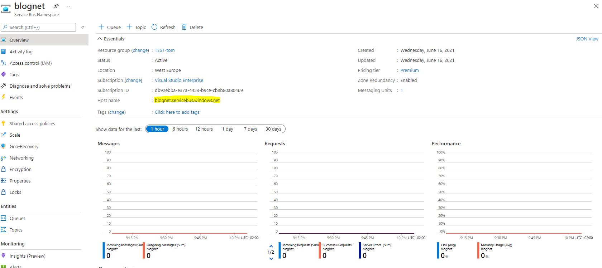

Wondering how you can integrate a [qpid dispatch router](https://qpid.apache.org/components/dispatch-router/index.html) with [azure service bus](https://azure.microsoft.com/nl-nl/services/service-bus/)? But not sure what steps you need to take?

No problem. I've got you covered! In my blog [building a integration platform based on an open standard](https://blognet.tech/2021/BuildingAnIntegrationPlatformBasedOnAnOpenStandard/) I introduced the qpid dispatch router, so I will skip that in this blog.

In this post, I'll help you to connect a router to an azure service bus in just 5 steps. An example implementation can be found on my [github page](https://github.com/tom171296/connect-router-to-azure).

Let's get started:

# 1. Connection to azure
To connect the router to azure you need to define a `connector` in the routers configuration file. A connector has a three different types of roles.

- `Interior`: used to connect to another interior router;
- `Edge`: used to connect to an edge router;
- `route-container`: used to connect to an external AMQP container.

Because we want to connect to an external AMQP container (Azure service bus) we need to use the `route-container` role.

Beside the type of connection that we're going to create, we need to define the host address to which the router needs to create the connection. The host address can be found in the azure service bus in the azure portal.



Combining the steps above will result in the following configuration: 

```
connector {
    name: azure-servicebus-connector
    role: route-container //connect to external AMQP container
    host: {Your-hostname-here}
    port: 5672 // Default AMQP port
}
```

# 2. Securing your connection
To create a secure connection between the router and azure, we need to have two certificates. 
- A certificate for the router, which it uses to identify itself.
- A CA certificate from azure, so the router knows what CA (and certificates signed by that CA) it can trust.

There is a script that creates a certificate for the router in the [example project](https://github.com/tom171296/connect-router-to-azure/tree/main/certificates) that I created on github. Follow the ReadMe (Step x) to generate a certificate for the router.

To get a trusted CA from azure I went to the hostname address. In my case "blognet.servicebus.windows.net". The result will look something like this:


Export the public CA certificate from azure to an CRT file. Both the certificates are needed by the router to creawte a secure connection. In the example I mapped both certificates into the container using a volume.

To create a secure AMQP connection, an `sslProfile` is required.

```
sslProfile { 
    name: azure-service-bus-sslprofile
    certFile: /etc/pki/tls/certs/tls.crt
    caCertFile: /etc/pki/tls/certs/azure-ca.crt
    privateKeyFile: /etc/pki/tls/private/tls.key
    password: pass:{YOUR_PASSWORD_HERE}
}
```
- `certFile`: path to the certificate of the router.
- `caCertFile`: path to the azure certificate.
- `privateKeyFile`: path to the private key file of the router certificate.
- `password`: password of the private key file.

This sslProfile is used in the connector to azure.

```
connector {
    name: azure-service-bus
    role: route-container
    host: {YOUR_HOST_NAME}
    port: amqps #5671 
    sslProfile: azure-service-bus-sslprofile # Name of the sslProfile
    verifyHostname: true
}
```

# 3. Idle timeout
Wanneer je de bovenstaande stappen hebt doorlopen zou je een eerste verbinding kunnen maken met de azure service bus. Als je dit doet zal je, net als ik had, de volgende foutmelding krijgen: "Idle timeout value specified in connection OPEN ('8000 ms') is not supported. Minimum idle timeout is '10000' ms."

Azure vraagt om een minimale idle timeout van 10000 ms (10 sec). 

# 4. Azure service bus authentication

# 5. Autolink

# 6. Link route

# What's next


