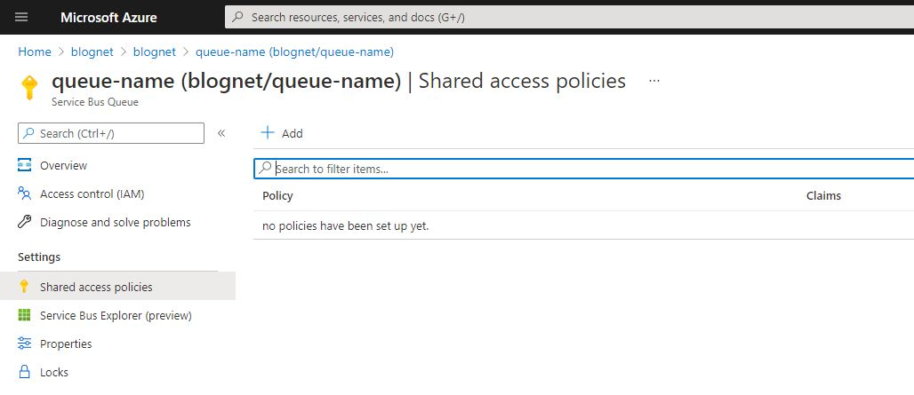
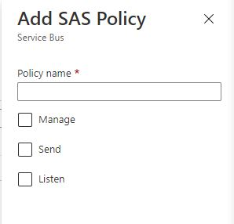

Wondering how you can integrate a [qpid dispatch router](https://qpid.apache.org/components/dispatch-router/index.html) with [azure service bus](https://azure.microsoft.com/nl-nl/services/service-bus/)? But not sure what steps you need to take?

No problem. I've got you covered! In my blog [building a integration platform based on an open standard](https://blognet.tech/2021/BuildingAnIntegrationPlatformBasedOnAnOpenStandard/) I introduced the qpid dispatch router, so I will skip that in this blog.

In this post, I'll help you to connect a router to an azure service bus in just 5 steps. An example implementation can be found on my [github page](https://github.com/tom171296/connect-router-to-azure).

Let's get started:

# 1. Connection to azure
To connect the router to azure you need to define a `connector` in the routers configuration file. A connector has a three different types of roles.

- `Interior`: used to connect to another interior router;
- `Edge`: used to connect to an edge router;
- `route-container`: used to connect to an external AMQP container.

Because we want to connect to an external AMQP container (Azure service bus) we need to use the `route-container` role.

Beside the type of connection that we're going to create, we need to define the host address to which the router needs to create the connection. The host address can be found in the azure service bus in the azure portal.


Combining the steps above will result in the following configuration: 

```
connector {
    name: azure-servicebus-connector
    role: route-container # connect to external AMQP container
    host: {Your-hostname-here}
    port: 5672 # Default AMQP port
}
```

# 2. Securing your connection
To create a secure connection between the router and azure, we need to have two certificates. 
- A certificate for the router, which it uses to identify itself.
- A CA certificate from azure, so the router knows what CA (and certificates signed by that CA) it can trust.

There is a script that creates a certificate for the router in the [example project](https://github.com/tom171296/connect-router-to-azure/tree/main/certificates) that I created on github. Follow the ReadMe (step 1) to generate a certificate for the router.

To get a trusted CA from azure I went to the hostname address. In my case `blognet.servicebus.windows.net`. The result will look something like this:


Export the public CA certificate from azure to an CRT file. Both the certificates are needed by the router to creawte a secure connection. In the example I mapped both certificates into the container using a volume.

To create a secure AMQP connection, an `sslProfile` is required.

```
sslProfile { 
    name: azure-service-bus-sslprofile
    certFile: /etc/pki/tls/certs/tls.crt
    caCertFile: /etc/pki/tls/certs/azure-ca.crt
    privateKeyFile: /etc/pki/tls/private/tls.key
    password: pass:{YOUR_PASSWORD_HERE}
}
```
- `certFile`: path to the certificate of the router.
- `caCertFile`: path to the azure certificate.
- `privateKeyFile`: path to the private key file of the router certificate.
- `password`: password of the private key file.

This sslProfile is used in the connector to azure.

```
connector {
    name: azure-service-bus
    role: route-container
    host: {YOUR_HOST_NAME}
    port: 5671 # Default AMQPS port
    sslProfile: azure-service-bus-sslprofile # Name of the sslProfile
    verifyHostname: true
}
```

# 3. Idle timeout
When you followed the steps above, you should be able to connect your router to the azure service bus. If you do so, you will see the following error message: 
 `Idle timeout value specified in connection OPEN ('8000 ms') is not supported. Minimum idle timeout is '10000' ms.` Apparently the default timeout is 8000 ms (8 sec).

Azure requires a minimum timeout of 10.000 ms (10 sec). The connector configuration has a property where you can set the idle timeout, `idleTimeoutSeconds`. When you set this property to 10 (sec) you will see the following message: `Idle timeout value specified in connection OPEN ('5000 ms') is not supported. Minimum idle timeout is '10000' ms.`

For some reason the property says `idleTimeoutSeconds` but underwater the value is divided by two for some reason. To get this working we need to set the timeout seconds to 20 at least.

```
connector {
    name: azure-service-bus
    role: route-container
    host: {YOUR_HOST_NAME}
    port: amqps 
    sslProfile: azure-service-bus-sslprofile
    verifyHostname: true
    idleTimeoutSeconds: 20 # Needed!
}
```

When you start the application, the timeout error will be gone and the first secure amqps connection is created to azure!

# 4. Azure service bus authentication
If you started your application you will see the following error message: 
`Auto Link Activation Failed. Unauthorized access. '{some claim}' claim(s) are required to perform this operation.`

The next step is using authentication in the router and be able to authenticate against the azure service bus.

At first, we need to add the [cyrus-sasl-plain](https://www.cyrusimap.org/sasl/) packages to the [docker image](https://github.com/tom171296/connect-router-to-azure/blob/main/Dockerfile). This package is used by the router to handle SASL authentication.

In the azure service bus there is a queue/topic to which we want to connect the router. In this topic/queue you need to create a "shared access policy" that is used for sasl authentication. 



Add a new sas policy and give it the claims that you need.



After you created the sas policy you need to update the router configuration:

```
connector {
    name: azure-service-bus
    role: route-container
    host: {YOUR_HOST_NAME}
    port: amqps #5671 
    sslProfile: azure-service-bus-sslprofile
    verifyHostname: true
    idleTimeoutSeconds: 20 
    saslMechanisms: PLAIN
    saslUsername: {SAS_POLICY_NAME} 
    saslPassword: pass:{SAS_POLICY_KEY} 
}
```
- `saslMechanism`: define that we want to use plain authentication.
- `saslUsername`: the name of the sas policy you just created.
- `saslPassword`: the primary or secondary key of the policy.

Once you updated your connector and start de docker image you will see that the router is connecting the azure service bus!

# 5. Autolink / Link route
There are two different types of connection that can be made to the azure service bus:
- Autolink
- Linkroute

The qpid documentation can explain what the key difference is between these two types. I will show you how you can create both these connection to an azure serivce bus.

## Autolink
A default autolink connection needs the following router configuration:
```
autoLink {
    address: pubsub/your/own/address/here    
    connection: azure-service-bus
    direction: {in/out}
}
```
- `address`: the routernetworks internal address to which this autolink is applicable to.
- `connection`: the name of the connector.
- `direction`: defines if the autolink is for incoming messages or outgoing messages.

An autolink connection can be made to the two different entities that a service bus offers. Most of the time the address in the service bus is different from the address that is used in the service bus. To connect the internal router address to an external service bus address, you need to define an external address in the autolink.

Creating a connection to a **queue** requires an external address where the value is set to the name of the queue. This is needed for incoming message as well as outgoing messages, because a queue always consist of one input and one output.

```
autoLink {
    address: pubsub/your/own/address/here    
    connection: azure-service-bus
    direction: {in/out}
    externalAddress: {queue-name}
}
```

For a **topic**, a different configuration is needed. When you publish a message to a topic, the message is spread along all the different subscriptions. To send a message to a topic, you will need to define the name of the topic as external address:

```
autoLink {
    address: pubsub/your/own/address/here    
    connection: azure-service-bus
    direction: out
    externalAddress: {topic-name}
}
```
It is possible to let a router be a subscriber for a topic. This means that the router becomes a consumer of the topic and needs its own subscription. To connect the autolink to a specific subscription, you need the following router configuration:

```
autoLink {
    address: pubsub/your/own/address/here    
    connection: azure-service-bus
    direction: out
    externalAddress: {topic-name}/subscriptions/{subscription-name}
}
```
The value of the external address consists of two different variables. The name of the topic followed by the static value "subscriptions" followed by the name of the specific subscription.

## Link route
Link routing doesn't need a address specific router configuration. The default router configuration for a link route can look like this:

```
linkRoute {
    prefix: *
    connection: azure-service-bus
    direction: {in/out}
}
```
- `prefix`: the prefix of an address that is handled with this link route. * means everything, you can make it more specific for your use case.
- `connection`: the name of the connector.
- `direction`: defines if the linkroute is for incoming messages or outgoing messages.

The external address configuration is defined in the address to which an application is listening to. In the [example link route application](https://github.com/tom171296/connect-router-to-azure/tree/main/linkroute) you see that the amqp address to which the application is connecting can have the same value as the autolink external address. This means that an linkroute can connect to a queue as well as a topic subscription. 


# What's next

So we integrated the qpid dispatch router with an azure service bus in just 5 simple steps. Together with my blog about [building a integration platform based on an open standard](https://blognet.tech/2021/BuildingAnIntegrationPlatformBasedOnAnOpenStandard/) I hope you guys got enough information and inspiration to think outside of the box. 

Centralized integration platforms aren't needed anymore. The teams should be responsible for building integrations and what type of integration pattern is best suited for their use case. With this solution it's even possible to let a team use their own cloud native services for integration!
